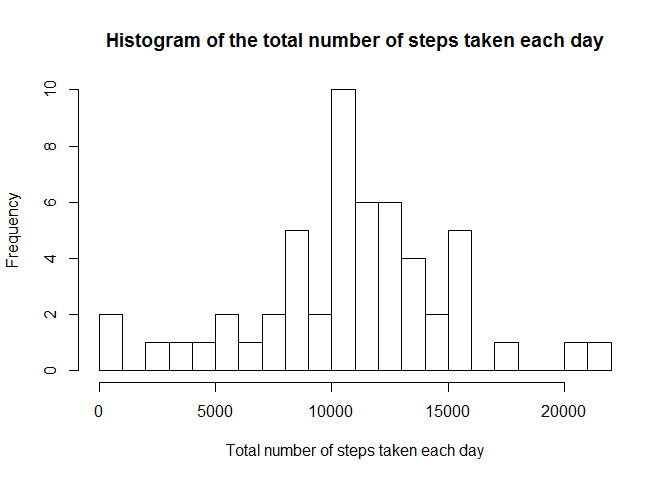
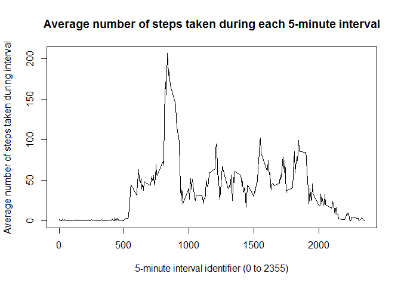
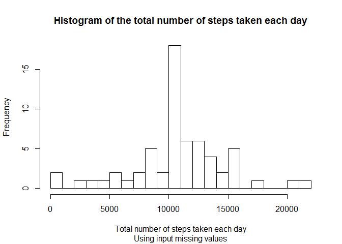
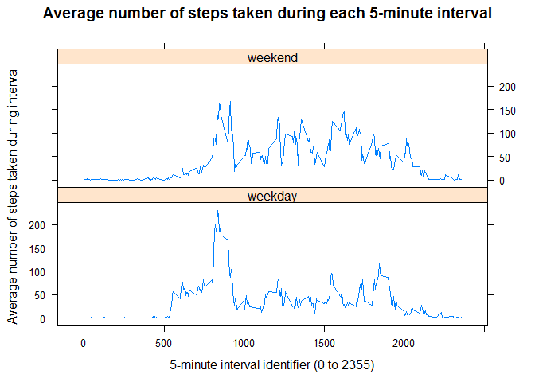

# Reproducible Research: Peer Assessment 1

It is now possible to collect a large amount of data about personal
movement using activity monitoring devices such as a
[Fitbit](http://www.fitbit.com), [Nike
Fuelband](http://www.nike.com/us/en_us/c/nikeplus-fuelband), or
[Jawbone Up](https://jawbone.com/up). These type of devices are part of
the "quantified self" movement -- a group of enthusiasts who take
measurements about themselves regularly to improve their health, to
find patterns in their behavior, or because they are tech geeks. But
these data remain under-utilized both because the raw data are hard to
obtain and there is a lack of statistical methods and software for
processing and interpreting the data.

This assignment makes use of data from a personal activity monitoring
device. This device collects data at 5 minute intervals through out the
day. The data consists of two months of data from an anonymous
individual collected during the months of October and November, 2012
and include the number of steps taken in 5 minute intervals each day.

We first load the libraries (muting output to avoid harmless but verbose warnings).


```r
library(lubridate)
library(dplyr)
library(lattice)
```

## Loading and preprocessing the data

The zipped data set comes from [Activity monitoring data](https://d396qusza40orc.cloudfront.net/repdata%2Fdata%2Factivity.zip).

If the data file is missing, we download the zipped data file (as required) and unzip it.

We then read the data set from the CSV-formatted data file.


```r
dataZipFileUrl <- "https://d396qusza40orc.cloudfront.net/repdata%2Fdata%2Factivity.zip"
dataZipFile <- "activity.zip"
dataFile <- "activity.csv"

# download and unzip data file if it doesn't exist
if (!file.exists(dataFile)) {
  if (!file.exists(dataZipFile)) {
    download.file(dataZipFileUrl, dataZipFile, mode = "wb")
  }
  unzip(dataZipFile)
}

# read data
activity <- read.csv(dataFile)
```

The variables in the data set are:

* **steps**: Number of steps taking in a 5-minute interval (missing
    values are coded as `NA`)

* **date**: The date on which the measurement was taken in YYYY-MM-DD
    format

* **interval**: Identifier for the 5-minute interval in which
    measurement was taken.
    
    Note that the intervals are not evenly spread out, for instance the interval after 55 is 100 — i.e. 1 hour and 0 minutes — rather than 60.

To make processing easier, we'll convert the text-formatted dates to R-native date objects using the `lubridate` package.


```r
# convert date column format from string to POSIXct
activity$date <- ymd(activity$date)
```

## What is mean total number of steps taken per day?

For this part of the assignment, the missing values in the data set will be ignored.

We first calculate the total number of steps taken per day.


```r
dailyActivity <- activity %>% 
  na.omit() %>% 
  group_by(date) %>% 
  summarise(totalSteps = sum(steps))
```

We now make a histogram of the total number of steps taken each day.


```r
hist(dailyActivity$totalSteps, breaks = 20, 
     main = "Histogram of the total number of steps taken each day",
     xlab = "Total number of steps taken each day")
```



Finally, we calculate the mean and median of the total number of steps taken per day.


```r
meanDailyTotalSteps <- mean(dailyActivity$totalSteps)
meanDailyTotalSteps
```

```
## [1] 10766.19
```

```r
medianDailyTotalSteps <- median(dailyActivity$totalSteps)
medianDailyTotalSteps
```

```
## [1] 10765
```

The mean total number of steps taken per day is 10,766.19 steps.

The median total number of steps taken per day is 10,765 steps.

## What is the average daily activity pattern?

For this part of the assignment, the missing values in the data set will be ignored.

We first calculate the total number of steps taken per interval, averaged across all days.


```r
intervalActivity <- activity %>% 
  na.omit() %>% 
  group_by(interval) %>% 
  summarise(averageDailySteps = mean(steps))
```

We now make a time series plot of the 5-minute interval (x-axis) and the average number of steps taken, averaged across all days (y-axis).


```r
plot(averageDailySteps ~ interval, data = intervalActivity, type = "l",
     xlab = "5-minute interval identifier (0 to 2355)",
     ylab = "Average number of steps taken during interval",
     main = "Average number of steps taken during each 5-minute interval")
```



Finally, we determine which 5-minute interval, on average across all the days in the data set, contains the maximum number of steps.


```r
indexMaxSteps <- which.max(intervalActivity$averageDailySteps)
intervalMaxSteps <- intervalActivity$interval[indexMaxSteps]
stepsAtIntervalMaxSteps <- intervalActivity$averageDailySteps[indexMaxSteps]
stepsAtIntervalMaxSteps
```

```
## [1] 206.1698
```

The 5-minute interval that, on average across all the days in the data set, contains the maximum number of steps is interval number 835 (contains 206.1698 steps).

## Inputing missing values

There are a number of days/intervals where there are missing values (coded as NA). The presence of missing days may introduce bias into some calculations or summaries of the data.

We first calculate the total number of missing values in the data set (i.e. the total number of rows with NAs).

We observe that NAs only appear in the `steps` column:


```r
colSums(is.na(activity))
```

```
##    steps     date interval 
##     2304        0        0
```

Therefore, the total number of missing values in the data set is equal to the number of NAs in the `steps` column.


```r
numMissingValues <- sum(is.na(activity$steps))
numMissingValues
```

```
## [1] 2304
```

```r
ratioMissingValues <- mean(is.na(activity$steps))
ratioMissingValues
```

```
## [1] 0.1311475
```

There are 2,304 missing values (13.1% percent of total values).

We now fill in all of the missing values in the data set by replacing each missing `steps` value with the mean number of steps for that 5-minute interval.

As an illustration, consider activity at index 286, which is missing a `steps` value:


```r
activity[286,]
```

```
##     steps       date interval
## 286    NA 2012-10-01     2345
```

The interval for this activity is 2345.

The average number of steps for interval 2345 is equal to:


```r
intervalActivity$averageDailySteps[intervalActivity$interval == 2345]
```

```
## [1] 0.6415094
```

So we would replace the `steps` value with 0.6415094.

We now proceed to fill in all missing values. The resulting new data set is named `activityNoNAs`.


```r
# duplicate data set
activityNoNAs <- activity

# get row indices where steps is NA
naIndices <- which(is.na(activityNoNAs$steps))

# for each row index with steps is NA
for (naIndex in naIndices) {
  # get interval number from the row
  intervalAtNaIndex <- activityNoNAs$interval[naIndex]
  
  # get mean number of steps for that interval (as previously calculated)
  meanStepsForIntervalsAtNaIndex <- 
    intervalActivity$averageDailySteps[
      intervalActivity$interval == intervalAtNaIndex]
  
  # replace missing steps value with this mean number of steps
  activityNoNAs$steps[naIndex] <- meanStepsForIntervalsAtNaIndex
}
```

We'll make sure that the resulting data set has the expected value for index 286 (as illustrated above).


```r
activityNoNAs[286,]
```

```
##         steps       date interval
## 286 0.6415094 2012-10-01     2345
```

We'll also make sure that there are no NAs in the new data set.


```r
sum(is.na(activityNoNAs))
```

```
## [1] 0
```

The following figure shows a histogram of the total number of steps taken each day based on the new data set.


```r
dailyActivityNoNAs <- activityNoNAs %>% 
  na.omit() %>% 
  group_by(date) %>% 
  summarise(totalSteps = sum(steps))

hist(dailyActivityNoNAs$totalSteps, breaks = 20, 
     main = "Histogram of the total number of steps taken each day",
     sub = "Using input missing values",
     xlab = "Total number of steps taken each day")
```



Finally, we calculate the mean and median of the total number of steps taken per day, using the data set with input missing values.


```r
meanDailyTotalStepsNoNAs <- mean(dailyActivityNoNAs$totalSteps)
meanDailyTotalStepsNoNAs
```

```
## [1] 10766.19
```

```r
medianDailyTotalStepsNoNAs <- median(dailyActivityNoNAs$totalSteps)
medianDailyTotalStepsNoNAs
```

```
## [1] 10766.19
```

The mean total number of steps taken per day, using the new data set, is 10,766.19 steps, which is identical to the mean total number of steps taken per day in the original data set.

The median total number of steps taken per day is 10,766.19 steps, up from 10,765 steps in the original data set.

Our missing data input strategy has had little if any impact on the mean and median total number of steps taken per day, despite a fairly high percentage of missing values.

## Are there differences in activity patterns between weekdays and weekends?

First, we add a new column, `dayType`, to the data set with the filled-in missing values, containing `weekday` and `weekend` depending on whether the date of the activity is a weekday or weekend day, respectively.

Note: we will be using `lubdridate::wday()` to determine the day of the week as a decimal number (as `weekdays()` returns strings which are locale-dependent, and setting locales may not have a consistent behaviour across operating systems).


```r
# add new column with day type (days 2 to 6 are week days, others are weekend 
# days) as factor
activityNoNAs$dayType <- as.factor(ifelse(wday(activityNoNAs$date) %in% 2:6, 
                                          "weekday", "weekend"))
```

We now create a pair of time series plots of the 5-minute interval (x-axis) and the average number of steps taken, averaged across all days (y-axis), for both weekend days and week days, using the `lattice` package's `xyplot()` function.


```r
# first summarise data by interval and type of day
intervalActivityNoNAs <- activityNoNAs %>% 
  group_by(interval, dayType) %>% 
  summarise(averageDailySteps = mean(steps))

# create plots
xyplot(averageDailySteps ~ interval | dayType, data = intervalActivityNoNAs, type = "l",
     xlab = "5-minute interval identifier (0 to 2355)",
     ylab = "Average number of steps taken during interval",
     main = "Average number of steps taken during each 5-minute interval",
     layout = c(1,2))
```


